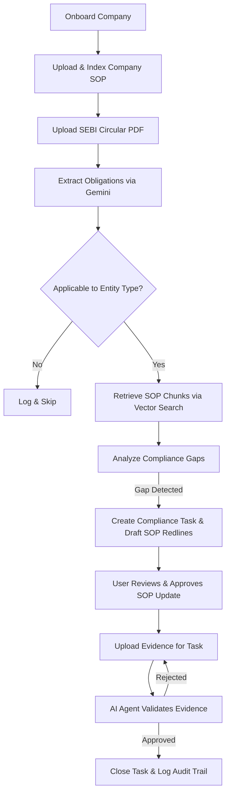

# RegIntel AI Compliance OS

**RegIntel AI Compliance OS** is an intelligent, agentic compliance copilot designed for SEBI-regulated financial institutions (Asset Management Companies, Mutual Funds, Brokerages, Portfolio Managers, and Investment Advisors). 

It automates the ingestion of SEBI regulatory circulars, extracts actionable obligations, performs semantic gap analysis against company Standard Operating Procedures (SOPs), drafts redlined policy updates, and validates compliance evidence using advanced AI agents.

---

## 🚀 Key Features

* **AI-Powered Circular Ingestion**: Automatically extracts structured compliance obligations (clause-by-clause) from SEBI circular PDFs using Google Gemini (`gemini-2.5-flash`).
* **Semantic SOP Gap Analysis**: Uses Google’s vector embeddings (`text-embedding-004`) and cosine similarity matching to locate relevant sections in company SOPs and evaluate whether they meet new SEBI guidelines.
* **Automated SOP Redlining**: Generates side-by-side drafts of proposed SOP modifications with redline diffs and legal reasoning.
* **Evidence Validation Agent**: Evaluates uploaded audit evidence (PDFs/text) against specific obligations to verify if the organization meets compliance requirements before closing tasks.
* **Risk Scorecard**: Live calculations of compliance risk ratings, factors, and dynamic compliance action plans.
* **Immutable Audit Trail & PDF Reports**: Automatically logs onboarding, reviews, and evidence audits, providing printable compliance report exports.

---

## 🛠️ Architecture & Tech Stack

### Frontend
* **Framework**: React 19 with Vite & TypeScript
* **Styling**: Tailwind CSS v4
* **Icons**: Lucide React

### Backend
* **API Framework**: FastAPI (Python 3.10+)
* **Database & Vector Storage**: SQLite (with embedded python-based cosine-similarity matching)
* **PDF Parser**: PyPDF
* **AI & LLM Services**: Google Generative AI SDK (`gemini-2.5-flash` & `text-embedding-004`)

---

## 🔄 Compliance Workflow



1. **Company Onboarding**: The user inputs company metadata (Entity Type: AMC, Broker, etc.).
2. **SOP Digitization & Vector Indexing**: Existing SOP manuals are uploaded, chunked, embedded via `text-embedding-004`, and saved in SQLite.
3. **SEBI Regulation Parsing**: A new circular is uploaded. The **Obligation Agent** parses it into discrete obligations.
4. **Cross-Referencing & Gap Identification**: The system maps obligations to entity types, performs cosine similarity searches to retrieve the relevant company SOP chunks, and identifies missing requirements.
5. **Redline Generation**: If there is a compliance gap, a task is created, and the **Drafting Agent** suggests the exact text changes to add to the SOP.
6. **Task Resolution & Evidence Audit**: Responsible departments address the tasks by uploading proof of compliance. The **Evidence Agent** reviews the file content to verify completion.
7. **Audit & Report**: System logs all changes in the immutable audit log and updates the compliance risk score.

---

## 💻 Local Machine Setup & Installation

Follow these steps to run the frontend and backend on your local machine:

### Prerequisites
* **Node.js** (v18.0.0 or higher)
* **Python** (v3.10 or higher)
* A **Google Gemini API Key** (Get one from [Google AI Studio](https://aistudio.google.com/))

---

### 1. Backend Setup

1. **Navigate to the backend directory**:
   ```bash
   cd backend
   ```

2. **Create a Virtual Environment**:
   ```bash
   python -m venv venv
   ```

3. **Activate the Virtual Environment**:
   * **Windows (PowerShell)**:
     ```powershell
     .\venv\Scripts\Activate.ps1
     ```
   * **macOS / Linux**:
     ```bash
     source venv/bin/activate
     ```

4. **Install Dependencies**:
   ```bash
   pip install -r requirements.txt
   ```

5. **Set up Environment Variables**:
   * Copy the template `.env.example` file to `.env`:
     ```bash
     cp .env.example .env
     ```
   * Open `.env` and enter your Google Gemini API Key:
     ```env
     GEMINI_API_KEY=your_actual_api_key_here
     ```

6. **Start the FastAPI Server**:
   Run the command from the **root directory** of the project:
   ```bash
   uvicorn backend.main:app --reload
   ```
   *The backend will run on [http://127.0.0.1:8000](http://127.0.0.1:8000).*

---

### 2. Frontend Setup

1. **Navigate to the frontend directory**:
   ```bash
   cd frontend
   ```

2. **Install Packages**:
   ```bash
   npm install
   ```

3. **Start the Dev Server**:
   ```bash
   npm run dev
   ```
   *The frontend dashboard will run on [http://localhost:5173](http://localhost:5173).*

---

## ⚡ Mock Data & Seeding

The application comes pre-seeded with mock database profiles for testing. On the initial startup of the backend:
* Seed data will automatically populate companies (e.g. *Zerodha Asset Management Private Limited*, *HDFC Mutual Fund*, *ICICI Securities*).
* Sample Mutual Fund & Broker circulars will be loaded.
* You can re-trigger database seeding manually at any time by sending a POST request to:
  `http://127.0.0.1:8000/api/seed` or by clicking the **Seed Database** utility in the dashboard.
